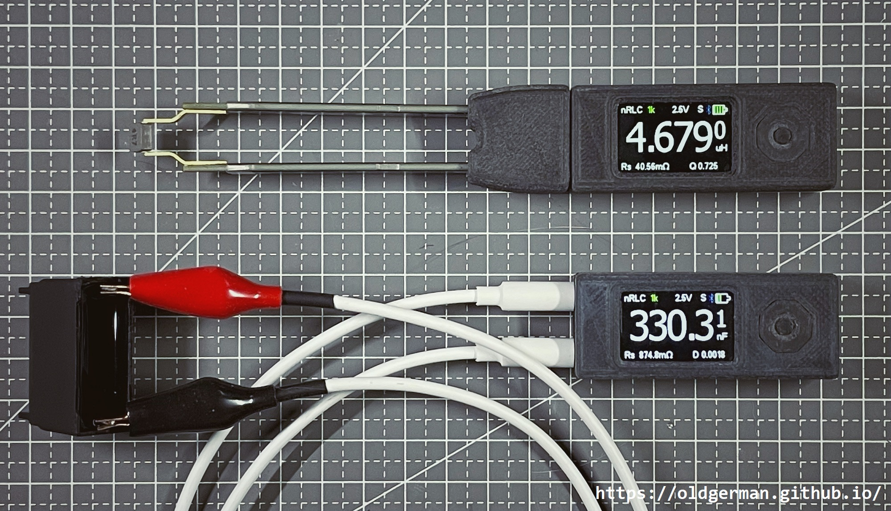

## nRLC-Split

[nRLC音频头版](https://oldgerman.github.io/1eb159fd/) 的制造文件（Manufacturing documentation for nRLC-Split）

### 关于

你第一次接触到本套文件可能是压缩包，内容可能滞后于仓库，制作前请访问[仓库地址](https://github.com/oldgerman/nRLC-Split)检查更新

PCB、原理图、钢网、外壳文件后续可能会改动，以最新的日期时间为准！

The first time you come into contact with this set of files, it may be a compressed package, and the content may lag behind the warehouse. Please visit the [github](https://github.com/oldgerman/nRLC-Split) to check for updates before making

PCB, schematic, stencil, and shell files may be changed later, the latest date and time shall prevail!



### 路径下各个文件夹的说明

```c
├─BOM                             // # PCB的物料清单，交互式BOM，使用浏览器打开
├─CAD                             // # 镊子触片CAD文件
├─Gerber                          // # 打板文件
│  ├─nRLC-Split                   // ## 【4层，板厚1.0mm】音频头版PCB
│  └─nRLC-Tweezers                // ## 【4层，板厚1.6mm】镊子PCB
├─Images                          // # 图片
├─Manual                          // # GFX网盘手册，添加了中文机器翻译
├─SCH                             // # 原理图
└─STL                             // # 3D打印模型
```

### 注意事项

PCB、原理图、钢网、外壳文件后续可能会改动，以最新的日期时间为准！

### 更新日志

| 日期           | 概述                                                        | 制造文件变动 | 备注                                              |
| -------------- | ----------------------------------------------------------- | ------------ | ------------------------------------------------- |
| 2024-0504 之前 | 无                                                          | 无           | 无                                                |
| 2024-0421      | 根据GFX网盘手册更新精确匹配的元件，在原理图中以粉色字体标出 | BOM、原理图  | 保留过去的BOM、原理图版本，但文件名添加了日期前缀 |

