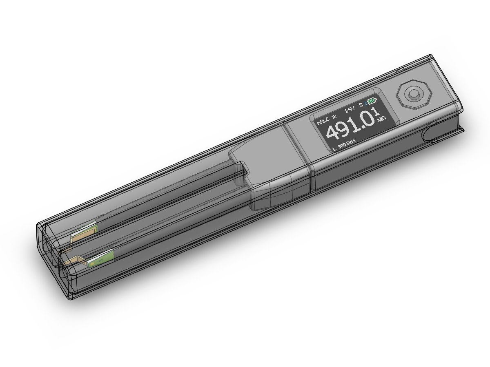

## 外壳打印文件

###  一套外壳固定用的五金件

不锈钢内六角螺丝杯头 x5
	规格：M1.6x12 (螺纹/螺纹的长度)，[链接](https://item.taobao.com/item.htm?id=40272016203)

注塑热熔铜滚花螺母 x5
	规格：外2.5 M1.6 1.5高，[链接](https://item.taobao.com/item.htm?id=39063858665)

### 中心按钮

打印的中心按钮尺寸不一定精确，中心按钮装入周围按钮后，底部最好和周围按钮一样平，按下按键才不会误触，不平的话请用3mm圆锉刀修整侧壁

### 整机收纳壳

中心按钮预留高度较高，装入整机收纳壳需要打磨一定厚度

